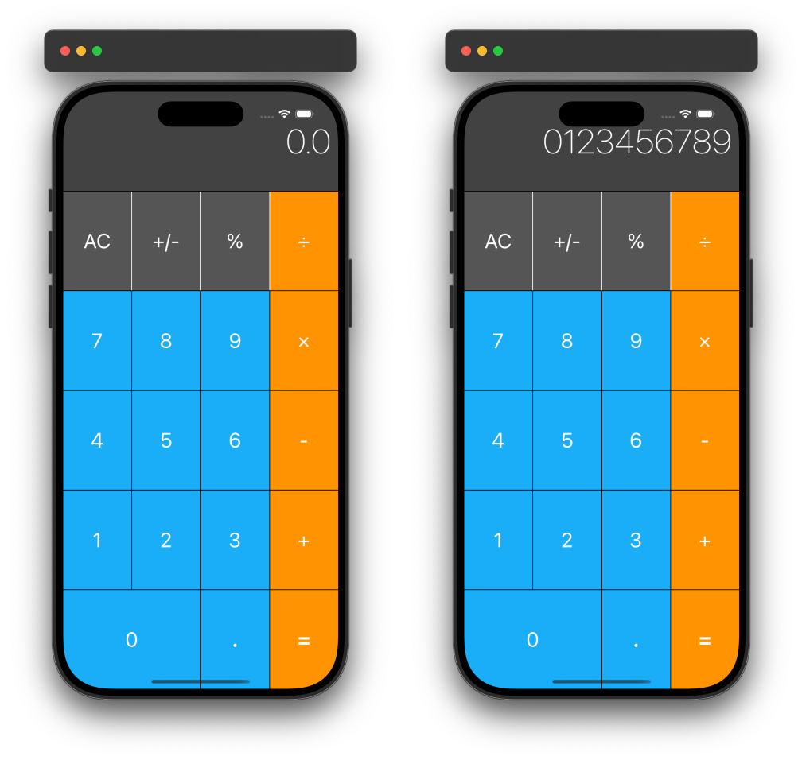

# Calculator

## Introduction

The **Calculator App** is a simple calculator designed using UIKit, showcasing core Swift principles and design patterns. This app allows users to perform basic arithmetic operations and demonstrates foundational concepts like MVC (Model-View-Controller) and custom logic encapsulation for reusable code.

## Preview

  

## Features

- **Arithmetic Operations**: Supports addition, subtraction, multiplication, division, percentage, and sign change.
- **Clear Function**: Allows users to reset the display.
- **User-Friendly UI**: Uses UIKit to create a simple and intuitive user interface.
- **MVC Pattern**: Separates the app logic into Model, View, and Controller components for clean, maintainable code.

## Code Structure

### Model

The `CalculatorLogic` struct is responsible for all calculation logic:
- It stores the current number and handles arithmetic operations.
- It performs calculations using helper functions for operations and ensures clean handling of each operation type.

### View

The `ViewController` class manages the main display and interaction logic:
- **Display Label**: Shows the entered numbers and results.
- **Button Handlers**: Processes numerical and operation button presses.

## Conclusion

This **Calculator App** is a foundational project for iOS developers looking to understand MVC principles and UIKit. By separating calculation logic from the UI, it demonstrates best practices for app organization and offers a reusable code structure for future enhancements.
